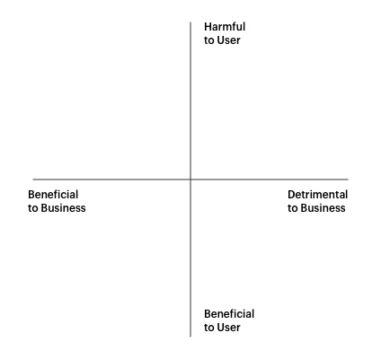

# Yin-Yang

* * *

According to the laws of unintended consequences, there will always be outcomes that we will overlook. How a product is used when it is first launched may change for better, worse, or a mix of both over the course of its existence. No one can answer ethical dilemas for us, we have to answer them for ourselves. This exercise is intended to simply bring awareness to a team and to prompt individuals to think of possible outcomes they may not have arrived at themselves.

### When to do this exercise: 

Either before or after product has been built and released to users to help a team ideate and understand unintended outcomes and potential ways the product could be manipulated for malicious or positive outcomes.

### Phase I, How: 

1. Have a designated facilitator draw a large square with four equal quadrants on a white board 
2. Along the top label the left side, "Now" and on the right, "In the Future". Along the right side of the square, write the question, "How could this product be used or manipulated for positive outcomes?" next to the top row. Below that, along the right side of the second row write the question, "How could this product be used or manipulated for malicious outcomes?".
3. Starting in the top left (now/good), have everyone on the team write their individual answers to the coordinating time frame and question silently on sticky notes with Sharpie pens (so that it's easily legible from afar). One idea per sticky for 5 to 8 minutes. The facilitator can keep time. Move on to the next quadrant in the top right (future/good) using the same techniques. After the top row has been completed, move on to the bottom left (now/malicious), and finish with the bottom right (future/malicious) quadrant.
4. As the team finishes each quadrant, place stickies inside the coordinating square. Affinity any similar thoughts into groups. Discuss what is there as a team. Time box the discussion to 10 minutes per quadrant, if necessary.
5. Talk until everyone feels heard but don't look for or drive for a consensus or resolution. Be conscientious of balancing good discussion with driving the exercise forward for everyone to put at least one sticky in each quadrant and say a word about it; this might take longer for groups larger than 8 people.
6. Finally, write a list of action items, if the group feels it's needed. This exercise pairs well with Assumptions & Experiments.

### Phase II, How: 

The second phase essentially comes down to three core competencies: tying patterns together, recognizing the tension, and then designing around it. That could go something like this:

1. Everyone on the team does a silent read-through of the Phase I exercise.
2. Working together and talking as you go, affinity (group) together the stickies which have similar themes across quadrant border lines.
3. For each theme take a single sticky note and draw a small 2x2 (beneficial/detrimental to biz against harmful/beneficial to users) and decide as a group through conversation where to plot a single point. Mark the point on the sticky and move on the to the next grouped theme until all themes have been satisfied.
4. Run a 
[How Might We](http://www.designkit.org/methods/3) or [Solution Brainstorm](http://www.designkit.org/methods/1) exercise as a follow up to find ways to mitigate or consider how to design/build around highest ethical concerns.

### Materials List:
1. Post-It notes of any color. One small stack, per person.
2. Sharpie Pens, thick. Best for viewing handwriting from far away.
3. Large white board and dry erase markers or large white paper and pens that will be easily legible from far away.
4. A stopwatch or cell phone for timing ideating and time boxing discussions.

[Download the PDF](assets/pdfs/Yin-Yang.pdf "yin yang download pdf")

